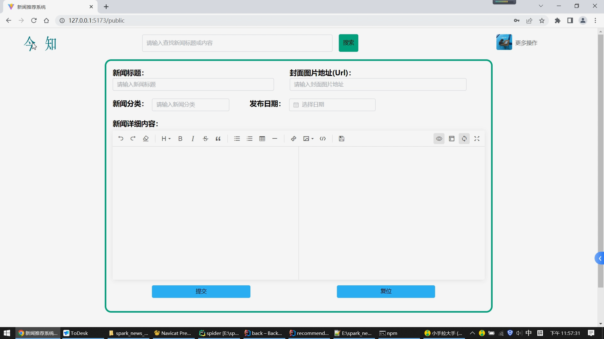
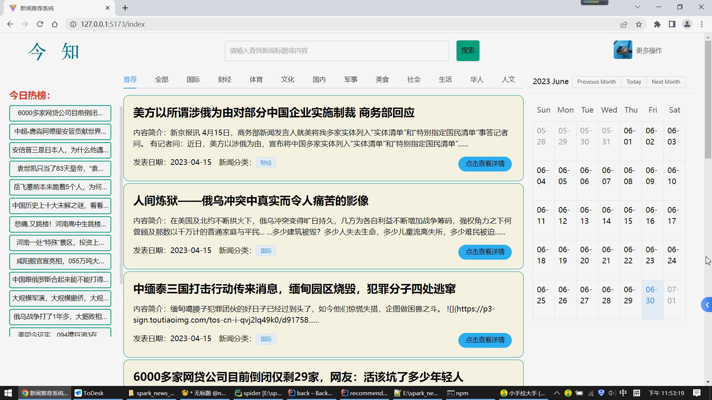
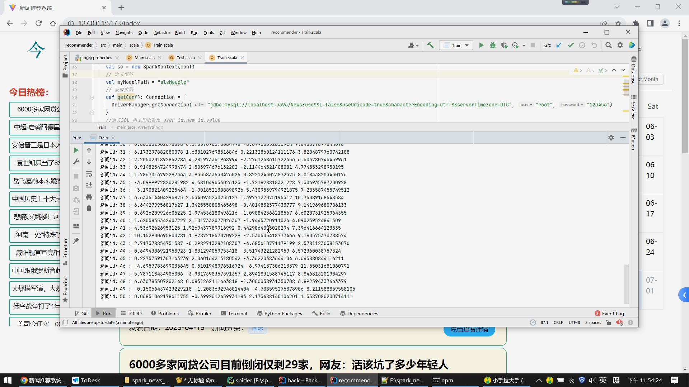
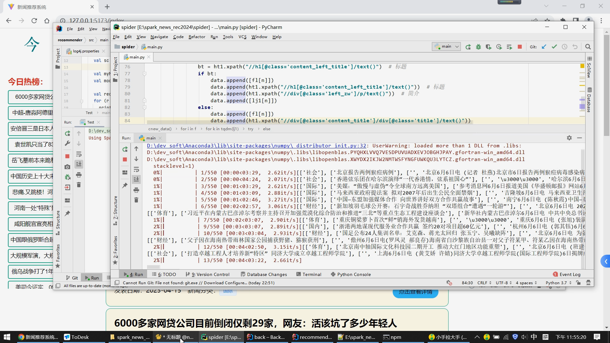
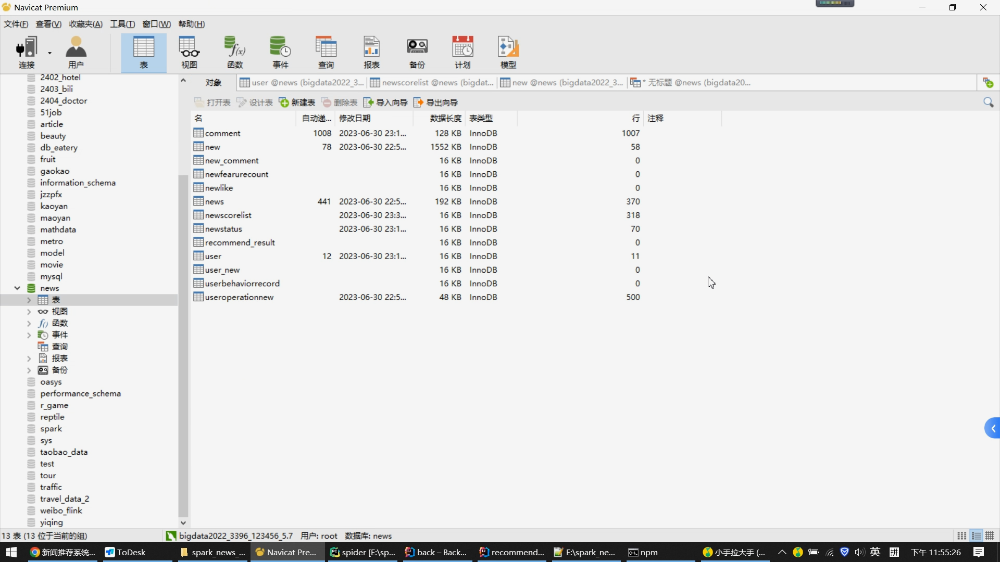
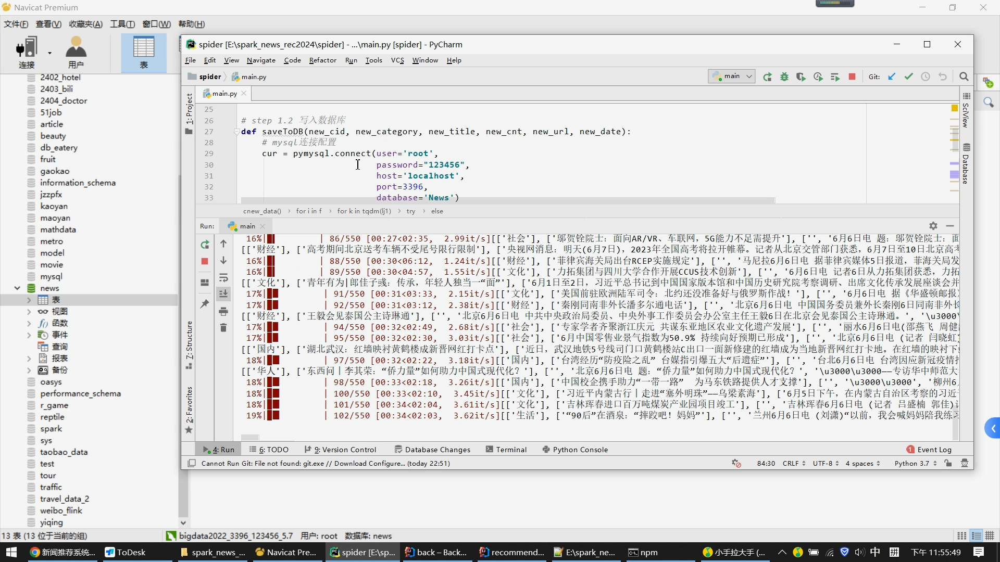
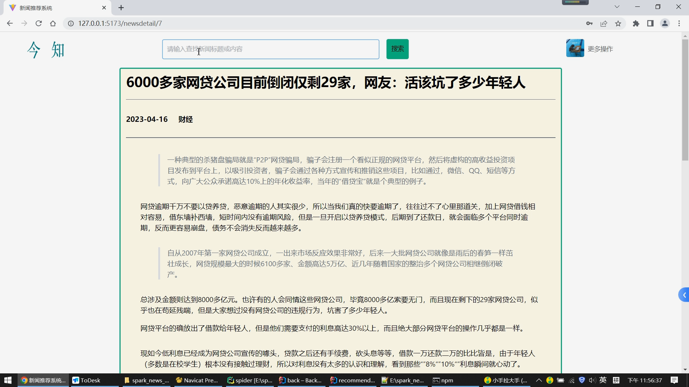

## 计算机毕业设计Python+SparkML知识图谱新闻推荐系统 新闻数据分析 新闻爬虫 新闻大数据 新闻可视化 大数据毕业设计 大数据毕设 机器学习 深度学习 大数据毕业设计 大数据毕设 机器学习 

## 要求
### 源码有偿！一套(论文 PPT 源码+sql脚本+教程)

演示视频

https://www.bilibili.com/video/BV1oj411S7V7/?spm_id_from=333.999.0.0

### 
### 加好友前帮忙start一下，并备注github有偿Spark新闻2024
### 我的QQ号是2827724252或者798059319或者 1679232425或者微信:bysj2023nb

# 

### 加qq好友说明（被部分 网友整得心力交瘁）：
    1.加好友务必按照格式备注
    2.避免浪费各自的时间！
    3.当“客服”不容易，repo 主是体面人，不爆粗，性格好，文明人。

本系统为我的本科毕业设计项目，毕设题目为“基于用户画像的电影推荐系统的设计与实现”。

本系统是以Django作为基础框架，采用MTV模式，数据库使用MongoDB、MySQL和Redis，以从豆瓣平台爬取的电影数据作为基础数据源，主要基于用户的基本信息和使用操作记录等行为信息来开发用户标签，并使用Hadoop、Spark大数据组件进行分析和处理的推荐系统。管理系统使用的是Django自带的管理系统，并使用simpleui进行了美化。

# 开发技术
1. 后端使用SpringBoot+Mybatis-Plus框架

2. 前端使用Vue.js+Element-Plus+Windi CSS框架

3. 数据爬虫使用Python+Scrapy框架

4. 大数据推荐功能使用Scala+Spark实现协同过滤算法，采用余弦相似度计算。

5. 使用Docker+Maven打包部署服务器

# 特色/创新点
Python爬虫

springboot

vue.js

SparkML

SparkALS

机器学习

深度学习

协同过滤算法
...10-20种创新点

# 运行截图

# 运行视频(B站)

https://www.bilibili.com/video/BV1oj411S7V7/?spm_id_from=333.999.0.0

